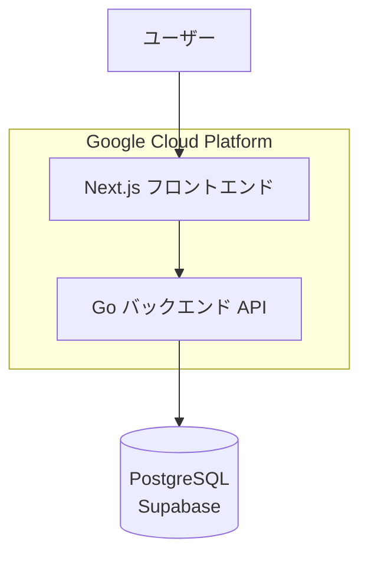
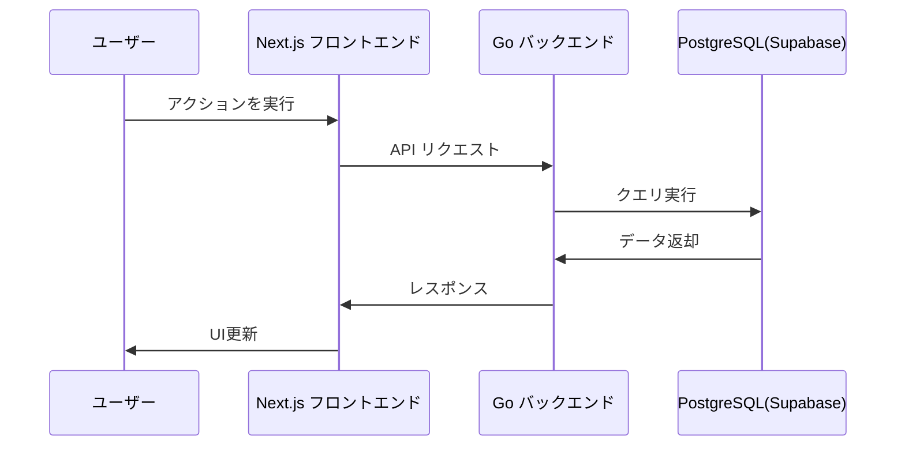
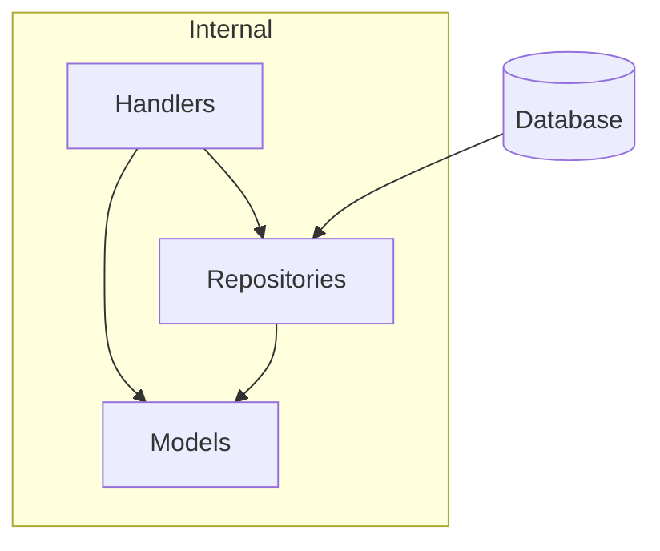
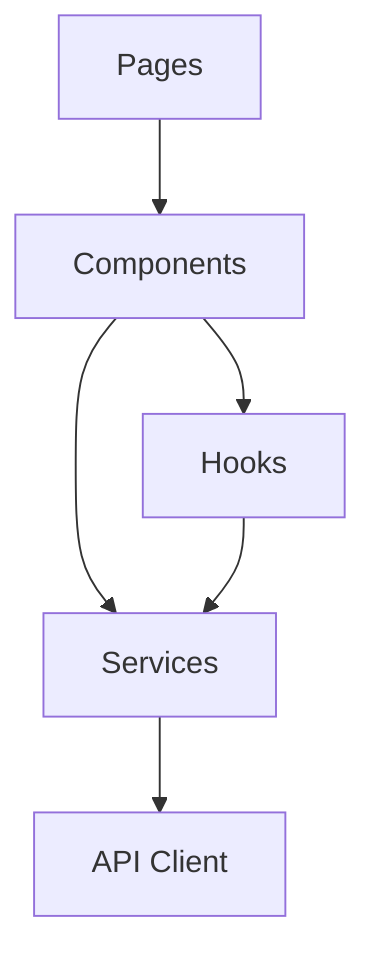
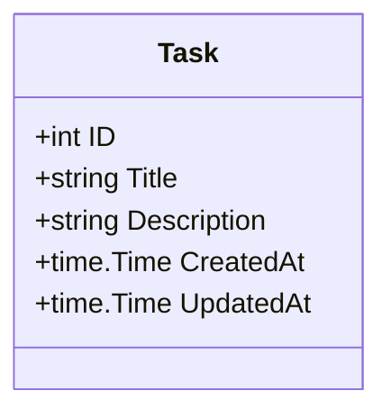
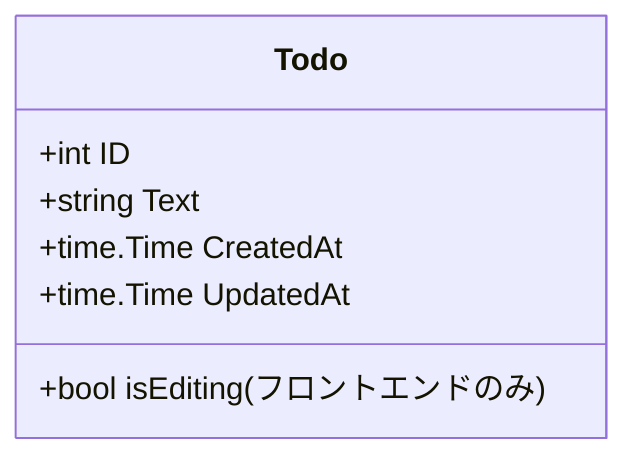

# Cloud Run タスク管理アプリケーション - プロジェクト概要

## 目次
- [プロジェクト概要](#プロジェクト概要)
- [システムアーキテクチャ](#システムアーキテクチャ)
- [技術スタック](#技術スタック)
- [ディレクトリ構造](#ディレクトリ構造)
- [バックエンド詳細](#バックエンド詳細)
- [フロントエンド詳細](#フロントエンド詳細)
- [APIエンドポイント仕様](#APIエンドポイント仕様)
- [データモデル](#データモデル)
- [開発環境セットアップ](#開発環境セットアップ)
- [デプロイメント](#デプロイメント)

## プロジェクト概要

このプロジェクトは、GoバックエンドとNext.jsフロントエンドを組み合わせたモダンなタスク管理アプリケーションです。マイクロサービスアーキテクチャを採用し、Google Cloud Runを活用したスケーラブルな構成となっています。

主な機能：
- タスク管理機能（CRUD操作）
- TODOリスト機能（CRUD操作）
- モダンなUI

デプロイ済みURL：
- フロントエンド: https://nextjs-frontend-896425711976.asia-northeast1.run.app/

## システムアーキテクチャ

プロジェクトはマイクロサービスアーキテクチャを採用しており、フロントエンドとバックエンドは分離されています。



### コンポーネント間データフロー



## 技術スタック

### バックエンド
- **言語**: Go 1.21
- **アーキテクチャ**: クリーンアーキテクチャベース
- **データベース**: PostgreSQL (Supabase)
- **主要パッケージ**:
  - `lib/pq`: PostgreSQLドライバー
  - `godotenv`: 環境変数管理
- **デプロイ**: Google Cloud Run

### フロントエンド
- **フレームワーク**: Next.js 15.1.6
- **言語**: TypeScript
- **UIコンポーネント**:
  - Radix UI
  - shadcn/ui
  - Tailwind CSS
- **HTTP クライアント**: Axios
- **デプロイ**: Google Cloud Run

## ディレクトリ構造

### バックエンド構成
```
backend/
├── cmd/            # エントリーポイント
│   └── api/        # APIサーバー
├── internal/       # 内部パッケージ
│   ├── config/     # 設定管理
│   ├── handler/    # HTTPハンドラ
│   ├── middleware/ # ミドルウェア
│   ├── model/      # ドメインモデル
│   └── repository/ # データアクセス層
├── pkg/            # 外部公開可能なパッケージ
│   └── database/   # データベース接続
├── .env.example    # 環境変数テンプレート
├── deploy.sh       # デプロイスクリプト
├── Dockerfile      # コンテナ定義
└── go.mod          # 依存関係
```

### フロントエンド構成
```
frontend/
├── src/
│   ├── app/       
│   │   ├── components/  # 共通コンポーネント
│   │   ├── hooks/       # カスタムフック
│   │   ├── services/    # API通信サービス
│   │   ├── task-manager/# タスク管理画面
│   │   ├── tasks/       # タスク一覧画面
│   │   └── types/       # 型定義
│   └── ...
├── public/         # 静的ファイル
├── Dockerfile      # コンテナ定義
├── deploy.sh       # デプロイスクリプト
└── package.json    # 依存関係
```

## バックエンド詳細

### アーキテクチャ概要

バックエンドはクリーンアーキテクチャのパターンに基づいて設計されています。



### 主要コンポーネント

1. **ハンドラー（Handler）**
   - HTTPリクエスト/レスポンスの処理
   - エンドポイントのルーティング
   - リクエストのバリデーション

2. **リポジトリ（Repository）**
   - データベースアクセスの抽象化
   - CRUDオペレーションの実装
   - クエリロジック

3. **モデル（Model）**
   - ドメインオブジェクトの定義
   - データ構造

### 実装ハイライト

#### ハンドラー
ハンドラーはHTTPリクエストを受け取り、適切なリポジトリメソッドを呼び出して、結果をJSONレスポンスとして返却します。

例：TaskHandler
```go
func (h *TaskHandler) HandleTasks(w http.ResponseWriter, r *http.Request) {
    switch r.Method {
    case http.MethodGet:
        h.getTasks(w, r)
    case http.MethodPost:
        h.createTask(w, r)
    default:
        http.Error(w, "Method not allowed", http.StatusMethodNotAllowed)
    }
}
```

#### リポジトリ
リポジトリはデータベースアクセスロジックをカプセル化します。

例：TaskRepository
```go
func (r *TaskRepository) GetAll() ([]model.Task, error) {
    rows, err := r.db.Query("SELECT id, title, description, created_at, updated_at FROM tasks")
    if err != nil {
        return nil, err
    }
    defer rows.Close()

    var tasks []model.Task
    for rows.Next() {
        var t model.Task
        if err := rows.Scan(&t.ID, &t.Title, &t.Description, &t.CreatedAt, &t.UpdatedAt); err != nil {
            return nil, err
        }
        tasks = append(tasks, t)
    }
    return tasks, nil
}
```

## フロントエンド詳細

### アーキテクチャ概要

フロントエンドはNext.jsを使用したReactアプリケーションです。



### 主要コンポーネント

1. **ページ（Pages）**
   - Next.jsのページコンポーネント
   - ルーティング

2. **コンポーネント（Components）**
   - 再利用可能なUIコンポーネント
   - 個別機能の実装

3. **サービス（Services）**
   - API通信ロジック
   - Axiosを使用したHTTPリクエスト

4. **フック（Hooks）**
   - カスタムReactフック
   - 状態管理と副作用

### 実装ハイライト

#### APIサービス
Axiosを使用してバックエンドAPIと通信します。

例：TaskService
```typescript
const TaskService = {
  getTasks: async () => {
    const response = await axios.get(`${API_URL}/api/tasks`);
    return response.data;
  },
  
  createTask: async (task: Omit<Task, 'id'>) => {
    return axios.post(`${API_URL}/api/tasks`, task);
  },
  
  // 他のメソッド...
};
```

#### カスタムフック
データフェッチングとステート管理のロジックをカプセル化します。

例：useTodos
```typescript
export function useTodos() {
  const [todos, setTodos] = useState<Todo[]>([]);
  const [isLoading, setIsLoading] = useState(true);

  useEffect(() => {
    const fetchTodos = async () => {
      const data = await TodoService.getTodos();
      setTodos(data);
      setIsLoading(false);
    };
    
    fetchTodos();
  }, []);

  // CRUD操作のメソッド...
  
  return {
    todos,
    isLoading,
    setTodos,
    // 他のメソッド...
  };
}
```

## APIエンドポイント仕様

### タスク管理API

| エンドポイント | メソッド | 説明 | リクエスト | レスポンス |
|--------------|---------|------|-----------|-----------|
| `/api/tasks` | GET | タスク一覧の取得 | - | Task[] |
| `/api/tasks` | POST | 新規タスクの作成 | Task | Task |
| `/api/task?id={id}` | GET | 特定タスクの取得 | - | Task |
| `/api/task?id={id}` | PUT | タスクの更新 | Task | Task |
| `/api/task?id={id}` | DELETE | タスクの削除 | - | 204 No Content |

### TODOリストAPI

| エンドポイント | メソッド | 説明 | リクエスト | レスポンス |
|--------------|---------|------|-----------|-----------|
| `/api/todos` | GET | TODO一覧の取得 | - | Todo[] |
| `/api/todos` | POST | 新規TODOの作成 | Todo | Todo |
| `/api/todo?id={id}` | GET | 特定TODOの取得 | - | Todo |
| `/api/todo?id={id}` | PUT | TODOの更新 | Todo | Todo |
| `/api/todo?id={id}` | DELETE | TODOの削除 | - | 204 No Content |

## データモデル

### タスク（Task）



### TODO（Todo）



## 開発環境セットアップ

### バックエンド（Go）

1. 環境変数の設定
```bash
cd backend
cp .env.example .env
# .envファイルを編集して必要な値を設定
```

2. ローカル開発環境の起動
```bash
go mod download
go run cmd/api/main.go
```

### フロントエンド（Next.js）

1. 環境変数の設定
```bash
cd frontend
cp .env.local.example .env.local
# .env.localファイルを編集して必要な値を設定
```

2. 依存パッケージのインストール
```bash
npm install
```

3. 開発サーバーの起動
```bash
npm run dev
```

## デプロイメント

### Google Cloud Runへのデプロイ

各ディレクトリの `deploy.sh` スクリプトを使用してデプロイを実行できます：

```bash
# バックエンドのデプロイ
cd backend
./deploy.sh

# フロントエンドのデプロイ
cd frontend
./deploy.sh
```

### コンテナ化

フロントエンドとバックエンドともにDockerfileが用意されており、コンテナ化されたアプリケーションとしてデプロイされています。

## 今後の開発計画

### 現在実装済みの機能
- ✅ タスク管理のCRUD操作
- ✅ TODOリストのCRUD操作
- ✅ モダンなUI実装
- ✅ Cloud Runへの自動デプロイ
- ✅ CORSサポート

### 開発中および今後の計画
- 🚧 ユーザー認証（JWT）
- 🚧 テストコードの整備
- 🚧 CI/CDパイプライン
- 📝 品質向上（テストカバレッジの向上、エラーハンドリングの強化）
- 📝 機能拡張（認証・認可、APIドキュメント、タスク共有機能）
- 📝 インフラ整備（監視・アラート、ログ収集、IaC） 